# DistributionEpidemic
灾害应急物资管理系统 亮点：AI问答、 Elasticsearch全文检索、ECharts检索分析、制度维护闭环、制度资料转为可检索条款；

所有源码均本人开发，项目是前后端分离的，所有的项目都具备了完整的业务逻辑，不仅仅局限于基础的增删改查（CRUD）操作，系统亮点众多。

本文注重于计算机毕业设计选题指导，列出题目均有源码， 大家可以去【公众号】(毕业终点站)获取或者加我【qq】(2112698948)提意见(别忘记Star哟)。备注：git

声明：仅用于学习使用，请勿用于任何商业行为！

1.系统非商用，非开源，非无偿。

2.由本人开发，如需源码，请联系以下方式，qq:2112698948。

3.项目有很多，并未全部上传，如果未找到想要的，可直接咨询。

# D6034 · 灾害应急物资管理系统

> 本项目仅用于学习交流。文档展示 16 张截图，需要了解更多，请联系我。

## 项目简介

灾害应急物资管理系统是一套面向灾害应急与公益救助场景的物资管理平台，采用 **前后端分离** 架构，由网页用户端与管理后台两部分组成，面向普通用户与物资管理员两类使用人群。

平台围绕物资的「进、存、出、公示」四条主线展开：普通用户可以在线浏览应急物资与爱心物资、提交物资申请与物资捐赠、查看发放公示与灾情资讯、在留言板反馈问题，并通过 AI 应急助手获取智能咨询；物资管理员负责应急与爱心物资维护、库存变动记录、捐赠审核入库、申请审批、发放登记以及数据看板分析。

在智能化与数据化方面，系统接入 DeepSeek 提供 AI 应急助手，围绕物资申领、捐赠、发放及防疫知识提供流式回复与历史会话管理；捐赠审核通过后自动关联物资并增加库存，记录入库明细；库存调整、申请审批扣减与批量发放出库均自动留痕，方便核查物资流向；并以 ECharts 展示物资库存、捐赠趋势、申请状态及区域发放分布，直观掌握物资管理情况。

## 技术架构

| 类别 | 技术选型与说明 |
| :--- | :--- |
| 架构 | B/S、MVC、前后端分离、网页用户端+管理后台，面向物资管理员与普通用户 |
| 系统环境 | Windows |
| 开发环境 | IDEA、JDK17、Maven、MySQL、Node.js |
| 后端技术 | Java 17、Spring Boot 3.3.1、Spring MVC、MyBatis-Plus、MySQL、JWT |
| 网页前端技术 | Vue 3、Vite、Element Plus、Vue Router、Pinia、Axios、ECharts |

## 系统亮点

1. **AI应急助手**：接入 DeepSeek，围绕应急物资申领、捐赠、发放及防疫知识提供智能咨询，支持流式回复与历史会话管理。

2. **物资全流程管理**：覆盖物资浏览、在线申请、后台审批与发放登记，支持应急物资和公益物资分类管理。

3. **捐赠入库联动**：支持在线提交物资捐赠，审核通过后自动关联物资并增加库存，记录捐赠入库明细。

4. **库存变动追溯**：支持库存调整、申请审批扣减与批量发放出库，自动记录库存变动及批次信息，方便核查物资流向。

5. **可视化数据看板**：使用 ECharts 展示物资库存、捐赠趋势、申请状态及区域发放分布，直观掌握物资管理情况。

6. **物资发放公示**：提供物资发放公开查询页面，展示发放记录，提升救助物资分配的透明度。

7. **灾情资讯与互动反馈**：支持灾情信息发布、通知查看和在线留言，方便用户获取资讯、提交问题与查看反馈

## 系统截图

> 截图存放于仓库 `images/` 目录，不依赖外部图床。

### 平台总览

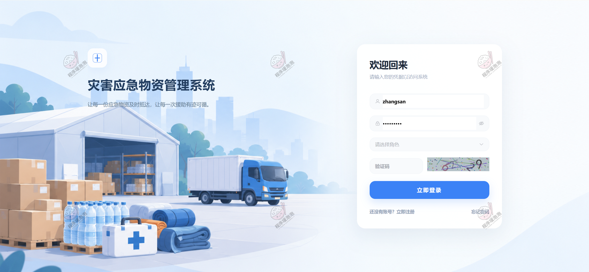

**图 1 · 平台总览**

### 用户端

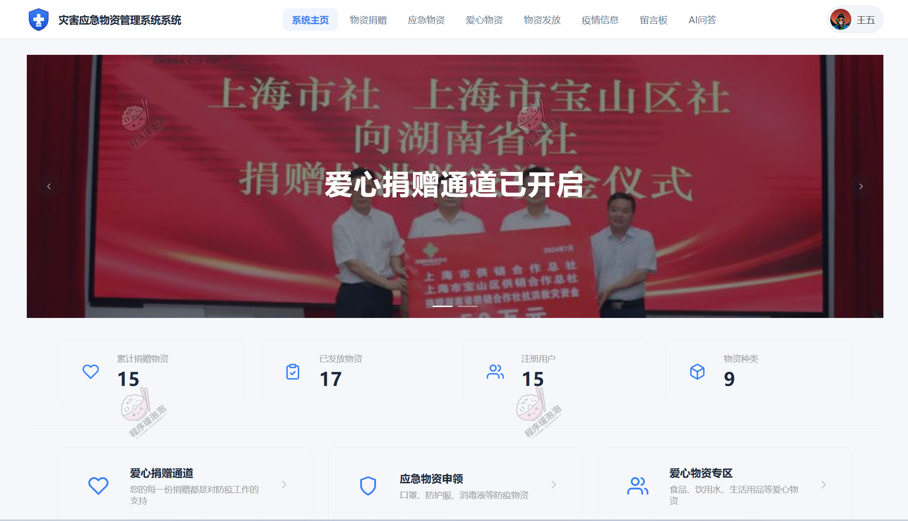

**图 2 · 首页**

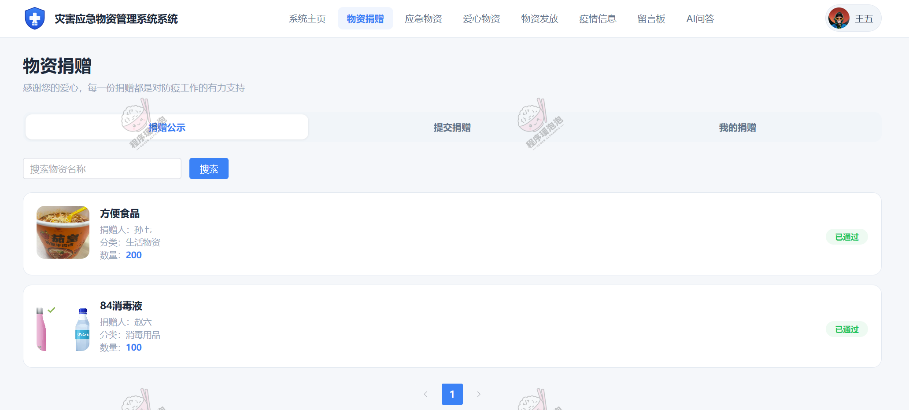

**图 3 · 物资捐赠**

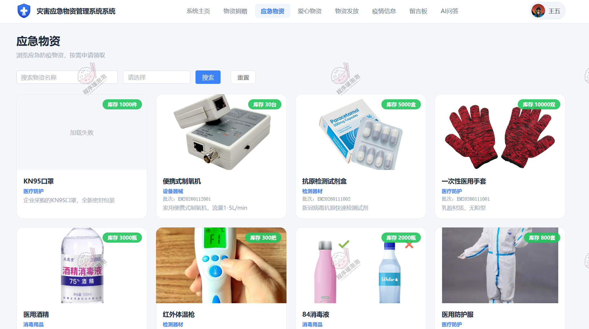

**图 4 · 应急物资**

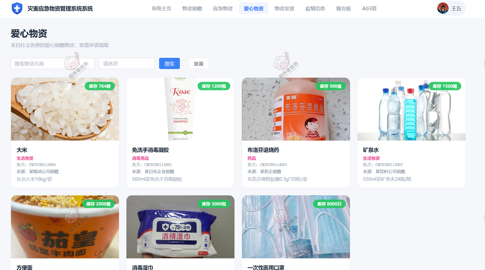

**图 5 · 爱心物资**

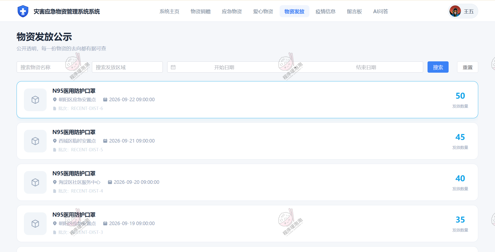

**图 6 · 物资发放**

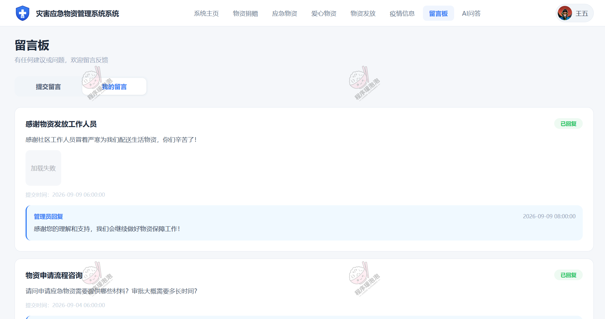

**图 7 · 留言板**

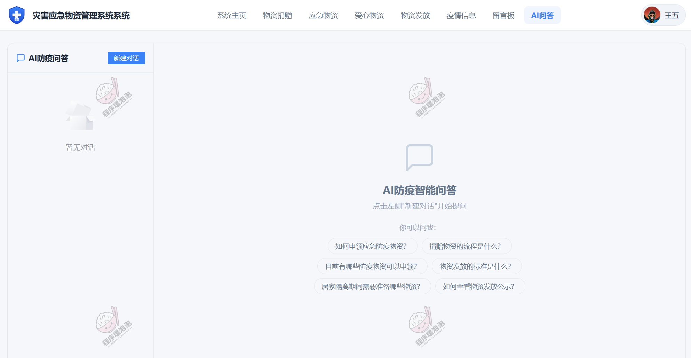

**图 8 · AI问答**

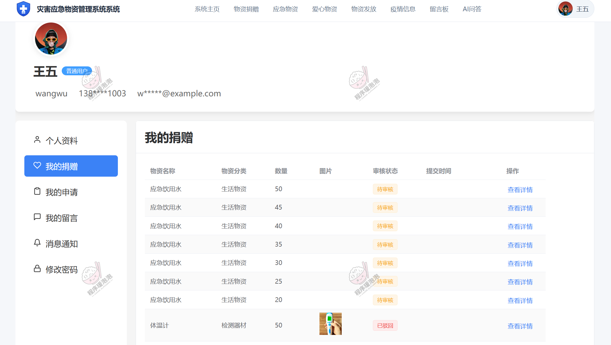

**图 9 · 我的捐赠**

### 管理员端

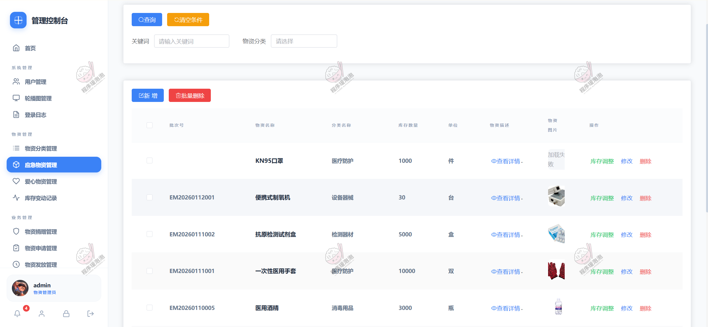

**图 10 · 应急物资管理**

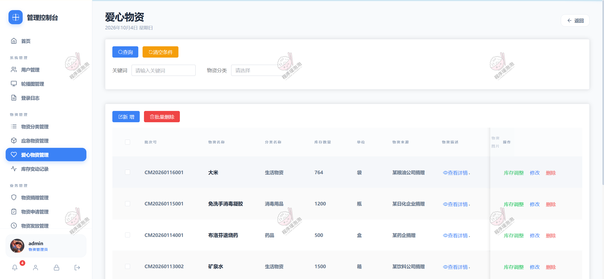

**图 11 · 爱心物资管理**

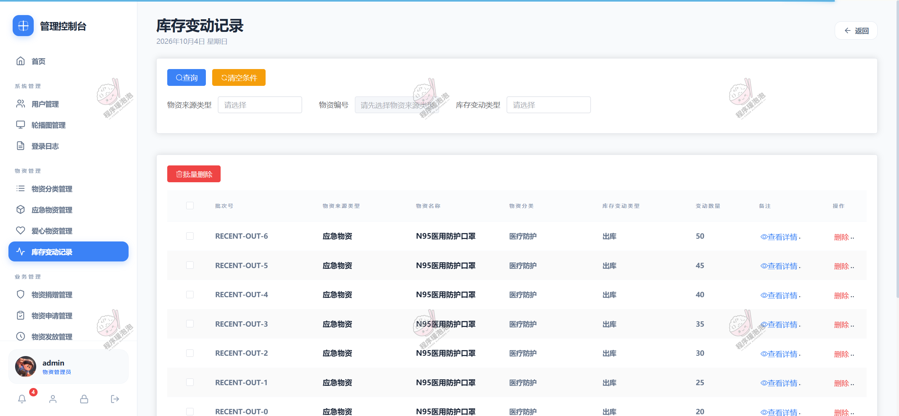

**图 12 · 库存变动记录**

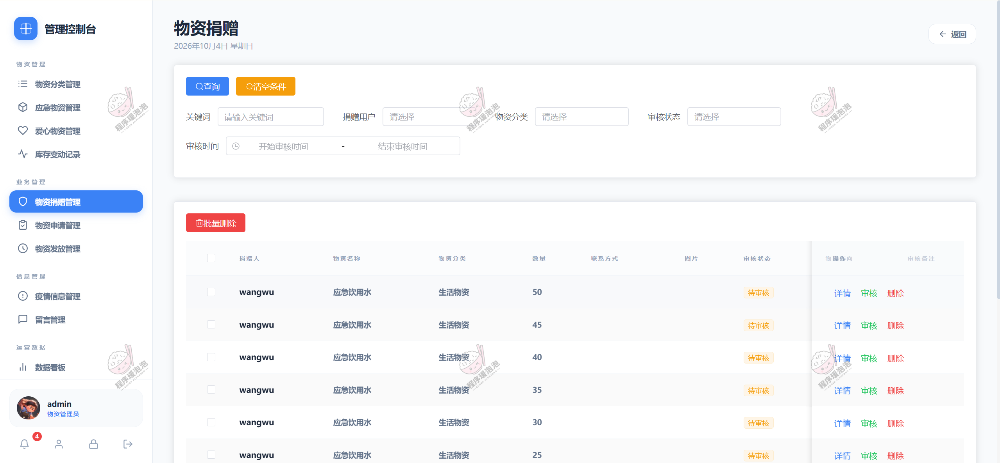

**图 13 · 物资捐赠管理**

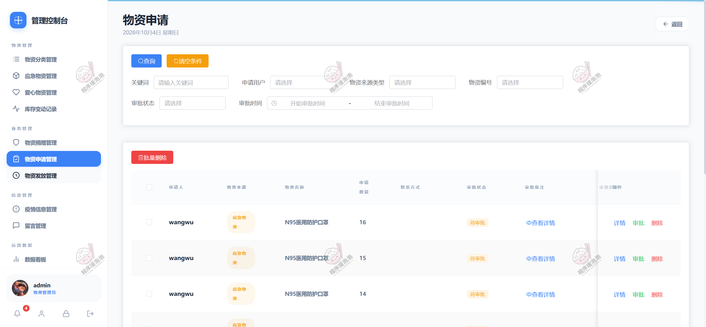

**图 14 · 物资申请管理**

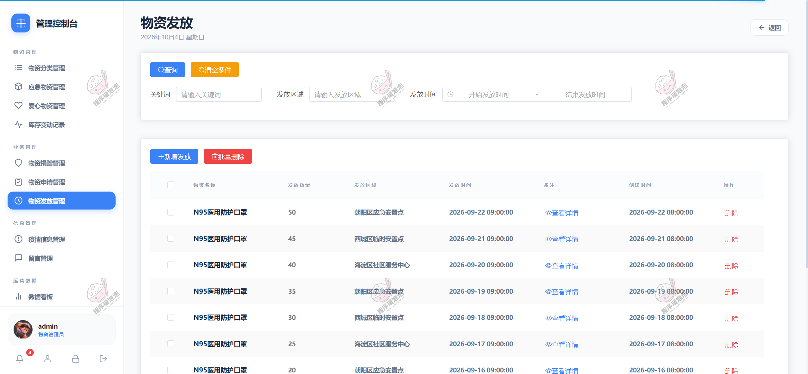

**图 15 · 物资发放管理**

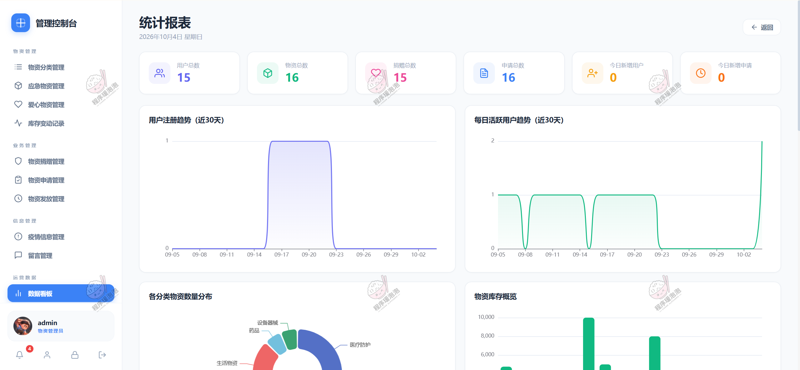

**图 16 · 数据看板**

---

**说明**：以上截图为系统部分功能演示页面，不同账号角色登录后可见菜单有所差异。

本项目仅用于学习交流，非商用、非开源、非无偿。

文档展示 16 张截图，需要了解更多，请联系我。
